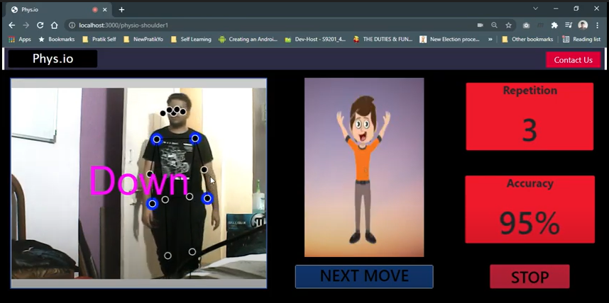

# AI Trainer
Physiotherapy trainer using PoseNet
 
Video Demo : https://youtu.be/ONlrG-83XZ8 
 
 

	

 
We will start by taking the video stream input from the user’s webcam. This input will be given to the PoseNet model. The PoseNet model detects the human body in the frame and then estimates its pose. It gives 17 landmarks over the body representing different joints. The coordinates of these landmarks will be the output of the model.
  
Then these coordinates are put in a classifier model to detect whether the user is in the required exercise pose. If the pose requirements are satisfied by the user for the selected exercise it will be counted as one repetition. 
  
For calculating the accuracy of the exercise being performed we are using the orientation of multiple landmarks and the angle between them. So, once the user is in the required pose, we will record those points, calculate the accuracy and give real-time feedback to the user.
  
Note: Still in development, the portal and improvement/addition of exercises.  
